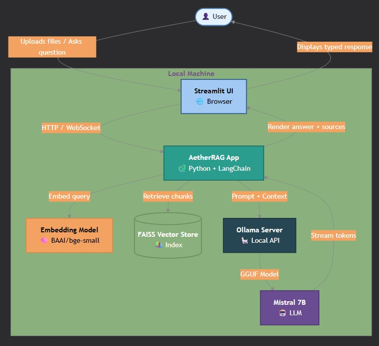
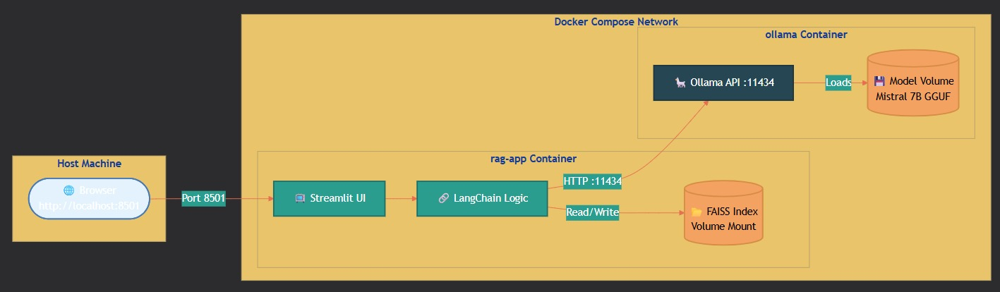
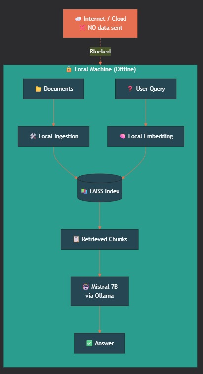

<p align="center">
  
</p>

<h1 align="center">AetherRAG</h1>

<p align="center">
  <b>Aether — Your Local, Private & Offline AI Assistant</b>
</p>

<p align="center">
  Retrieval-Augmented Generation (RAG) powered by FAISS, LangChain, Ollama and Mistral 7B.
</p>

---

<<<<<<< HEAD
=======
## 👨‍💻 Author

### Hritaansh Mehra  
GitHub: [Hritshhh](https://github.com/Hritshhh)

---

>>>>>>> a000fb31a20c25c6e7930d7524c15735116a8cd5
# 📖 About AetherRAG

AetherRAG is a fully local AI assistant that allows users to upload documents and interact with them conversationally using Retrieval-Augmented Generation (RAG).

<<<<<<< HEAD
The system is specifically designed to minimize hallucinations by grounding responses in retrieved document chunks instead of relying purely on parametric LLM memory.

=======
>>>>>>> a000fb31a20c25c6e7930d7524c15735116a8cd5
Unlike cloud-based AI systems, Aether runs entirely on the user's machine:

- 🔒 No external API calls
- 📡 Offline capable
- 🧠 Local LLM inference
- 📄 Local document indexing
- 🔐 Private semantic retrieval
<<<<<<< HEAD
- 📄 Source-backed answers with highlighted retrieval chunks
- 🧠 Hallucination-resistant RAG pipeline
- ✅ Explainable responses grounded in uploaded documents
=======
>>>>>>> a000fb31a20c25c6e7930d7524c15735116a8cd5

The assistant combines:

- **Mistral 7B** for language generation
- **FAISS** for vector similarity search
- **BAAI embeddings** for semantic understanding
- **LangChain** for orchestration
- **Ollama** for local LLM serving
- **Streamlit** for the interactive UI

---

# ✨ Features

- 🔒 Fully local & private AI assistant
<<<<<<< HEAD
- 📄 PDF / TXT / DOCX / CSV / JSON / Markdown ingestion
- 🧠 Semantic search using dense vector embeddings
=======
- 📄 PDF / TXT document ingestion
- 🧠 Semantic search using vector embeddings
>>>>>>> a000fb31a20c25c6e7930d7524c15735116a8cd5
- ⚡ Fast FAISS vector retrieval
- 🤖 Mistral 7B inference via Ollama
- 🐳 Dockerized deployment
- 💬 Chat-style Streamlit interface
<<<<<<< HEAD
- 📊 Confidence scoring with hallucination filtering
- 📄 Source chunk highlighting with quoted evidence
- 🧠 Retrieval-grounded generation
=======
- 📊 Confidence scoring & source highlighting
>>>>>>> a000fb31a20c25c6e7930d7524c15735116a8cd5
- 📡 Offline-first architecture
- ♻️ Incremental FAISS indexing
- 🧵 Streaming token generation
- 🧠 Context-aware greetings & acknowledgements
<<<<<<< HEAD
- ✅ Explainable AI responses with traceable context
- 🔍 Confidence-aware semantic retrieval
- 🚫 Weak-context rejection to reduce hallucinations
=======
>>>>>>> a000fb31a20c25c6e7930d7524c15735116a8cd5

---

# 🧠 Tech Stack

| Layer | Technology |
| --- | --- |
| Frontend | Streamlit |
| Application Logic | Python + LangChain |
| Embedding Model | BAAI/bge-small-en-v1.5 |
| Vector Database | FAISS |
| LLM Runtime | Ollama |
| Language Model | Mistral 7B Instruct |
| Containerization | Docker + Docker Compose |

---

# 🏗️ System Workflow

<p align="center">
  
</p>

<<<<<<< HEAD
The workflow begins with document upload and user queries through the Streamlit interface.

Documents are embedded locally using BAAI embeddings and stored inside a FAISS vector database. Queries are embedded similarly and semantically matched against stored chunks before contextual information is sent to the local Mistral 7B model through Ollama.

AetherRAG uses retrieval-grounded prompting, meaning the LLM generates answers only after receiving semantically relevant document chunks.

This enables:

- Source-grounded answering
- Reduced hallucinations
- Explainable AI responses
- Confidence-aware retrieval
- Transparent semantic search

---

=======
The workflow begins with document upload and user queries through the Streamlit interface. Documents are embedded locally using BAAI embeddings and stored inside a FAISS vector database. Queries are embedded similarly and semantically matched against stored chunks before context is sent to the local Mistral 7B model through Ollama.

---

>>>>>>> a000fb31a20c25c6e7930d7524c15735116a8cd5
# 🐳 Docker Architecture

<p align="center">
  
</p>

<<<<<<< HEAD
Docker isolates all dependencies and services into reproducible containers.

This solves:

- ✅ Dependency conflicts
- ✅ Environment inconsistencies
- ✅ OS compatibility issues
- ✅ Easier deployment
- ✅ Portable local AI setup
- ✅ Faster reproducible setup for other users
- ✅ Cleaner environment separation
- ✅ Simplified Ollama integration

The architecture separates:

- Streamlit application container
- Ollama inference container
- Persistent FAISS vector storage
- Internal Docker networking

This allows the entire RAG pipeline to run locally with minimal setup while maintaining consistent performance across systems.

---

# 🔒 Offline & Private RAG Pipeline

<p align="center">
  
=======
Docker isolates all dependencies and services into reproducible containers. This solves:

- ✅ Dependency conflicts
- ✅ Environment inconsistencies
- ✅ OS compatibility issues
- ✅ Easier deployment
- ✅ Portable local AI setup
- ✅ Faster reproducible setup for other users

The architecture separates:

- Streamlit application container
- Ollama inference container
- Persistent FAISS vector storage
- Internal Docker networking

---

# 🔒 Offline & Private RAG Pipeline

<p align="center">
  
>>>>>>> a000fb31a20c25c6e7930d7524c15735116a8cd5
</p>

AetherRAG is designed with an offline-first philosophy:

- No cloud APIs
- No external data transfer
- All embeddings generated locally
- All retrieval performed locally
- All inference performed locally

This makes the system highly suitable for:

- Academic usage
- Sensitive documents
- Research workflows
- Air-gapped environments
- Privacy-focused AI applications

<<<<<<< HEAD
All uploaded files remain on the user's machine and are processed entirely locally through the FAISS retrieval pipeline and Ollama-hosted Mistral model.

---

# ⚙️ Confidence Scoring & Hallucination Filtering

AetherRAG computes semantic relevance using FAISS similarity search.

The UI displays confidence badges based on retrieval strength:

| Confidence Range | Badge |
| --- | --- |
| High relevance | 🟢 High Confidence |
| Moderate relevance | 🟡 Medium Confidence |
| Weak relevance | 🔴 Low Confidence |

The scoring is derived from semantic similarity between:

- User query embeddings
- Retrieved document chunk embeddings

This helps users understand retrieval reliability during inference.

Queries scoring below approximately **45% semantic confidence** are rejected to reduce hallucinated or weakly grounded responses.

The confidence system acts as a retrieval-validation layer before final answer generation.

---

# 📄 Source Highlighting & Explainability

AetherRAG provides transparent, explainable responses by displaying:

- The source document name
- Retrieved text chunks
- Highlighted semantic evidence
- Confidence indicators

Instead of producing unsupported responses, the assistant shows the exact portions of text it retrieved and studied before generating an answer.

This creates:

- Explainable AI outputs
- Verifiable document-backed answers
- Reduced hallucinations
- Higher user trust
- Transparent semantic reasoning

The highlighted retrieval chunks act as quoted contextual proof for generated responses.

---

# 📂 Supported Documents

Currently supported:

- PDF (`.pdf`)
- Text (`.txt`)
- Word (`.docx`)
- CSV (`.csv`)
- Markdown (`.md`)
- JSON (`.json`)

Documents are:

1. Loaded locally
2. Chunked into semantic segments
3. Embedded using BAAI embeddings
4. Stored inside the FAISS index
5. Retrieved during querying
6. Passed as grounded context to the LLM

---

# 🚀 Running the Project

## Clone Repository
=======
---

# ⚙️ Confidence Scoring

AetherRAG computes semantic relevance using FAISS similarity search.

The UI displays confidence badges based on retrieval strength:

| Confidence Range | Badge |
| --- | --- |
| High relevance | 🟢 High Confidence |
| Moderate relevance | 🟡 Medium Confidence |
| Weak relevance | 🔴 Low Confidence |

The scoring is derived from semantic similarity between:

- User query embeddings
- Retrieved document chunk embeddings

This helps users understand retrieval reliability during inference.

---

# 📂 Supported Documents

Currently supported:

- PDF (`.pdf`)
- Text (`.txt`)

Documents are:

1. Loaded locally
2. Chunked into semantic segments
3. Embedded using BAAI embeddings
4. Stored inside FAISS index
5. Retrieved during querying

---

# 🚀 Running the Project

## 1️⃣ Clone Repository
>>>>>>> a000fb31a20c25c6e7930d7524c15735116a8cd5

```bash
git clone https://github.com/Hritshhh/AetherRAG.git
cd AetherRAG
```

---

# ▶️ Method 1 — Run Normally (Streamlit)

## Install Requirements

```bash
pip install -r requirements.txt
```

<<<<<<< HEAD
---

## Install Ollama

=======
## Install Ollama

>>>>>>> a000fb31a20c25c6e7930d7524c15735116a8cd5
Download Ollama from:

https://ollama.com

---

## Pull Mistral Model

```bash
ollama pull mistral:7b-instruct-v0.3-q4_K_M
```

---

## Run Application

```bash
streamlit run app.py
```

---

# 🐳 Method 2 — Run Using Docker

## Start Docker Desktop

Ensure Docker Desktop is running.

---

## Build & Start Containers

```bash
docker compose up --build
```

---

## Pull Mistral Model Inside Container

```bash
docker exec -it ollama ollama pull mistral:7b-instruct-v0.3-q4_K_M
```

---

## Access Application

Open in browser:

```bash
http://localhost:8501
```

---

# 📁 Project Structure

```bash
AetherRAG/
│
├── app.py
├── ingestion.py
├── utils.py
├── requirements.txt
├── docker-compose.yml
├── Dockerfile
│
├── faiss_index/
<<<<<<< HEAD
├── test/
=======
├── data/
>>>>>>> a000fb31a20c25c6e7930d7524c15735116a8cd5
│
└── assets/
    ├── logo.png
    ├── system_workflow.png
    ├── docker_architecture.png
<<<<<<< HEAD
    └── offline_architecture.png
=======
    └── offline_pipeline.png
>>>>>>> a000fb31a20c25c6e7930d7524c15735116a8cd5
```

---

# 🎯 Key Highlights

- Fully local RAG assistant
- Runs without internet
- Semantic retrieval using FAISS
<<<<<<< HEAD
- Source-grounded AI responses
- Hallucination-aware response filtering
- Explainable document-backed answers
- Confidence-based retrieval validation
- Transparent chunk highlighting
=======
>>>>>>> a000fb31a20c25c6e7930d7524c15735116a8cd5
- Local Mistral 7B inference
- Modern chat interface
- Incremental vector indexing
- Dockerized deployment
- Streamed token generation
- Confidence-aware retrieval
<<<<<<< HEAD
- Secure offline AI workflow
=======
>>>>>>> a000fb31a20c25c6e7930d7524c15735116a8cd5

---

# 📚 References

- LangChain  
https://www.langchain.com/

- Ollama  
https://ollama.com/

- FAISS  
https://github.com/facebookresearch/faiss

- Mistral AI  
https://mistral.ai/

- BAAI Embeddings  
https://huggingface.co/BAAI/bge-small-en-v1.5

---

# 📜 License

This project is intended for academic and educational purposes.

---

<<<<<<< HEAD
# 👨‍💻 Author

### Hritaansh Mehra  
GitHub: [Hritshhh](https://github.com/Hritshhh)

---

# ⭐ AetherRAG

> Private. Offline. Local. Yours.
=======
# ⭐ AetherRAG

> Private. Offline. Local. Yours.
>>>>>>> a000fb31a20c25c6e7930d7524c15735116a8cd5
